<p align="center">
  
</p>

<h1 align="center">⚡ WRO 2026 Future Engineers — Team Vitality</h1>

<p align="center">
  <a href="https://www.instagram.com/vitality2026.wro?stkn=dWI4NWJjdDJrMzQw">
    
  </a>
  <a href="https://youtu.be/qGNv-WUXziQ">
    
  </a>
</p>

---

## 👥 The Team

We are **Team Vitality**, three final-year high school students from Nairobi,
Kenya, competing in the **World Robot Olympiad™ (WRO®) Future Engineers 2026**
category.

| Member | Age | Year |
|---|---|---|
| **Ronak Agarwal** | 17 | Senior year of high school |
| **Saurabh Rawat** | 17 | Senior year of high school |
| **Raghav Mathur** | 17 | Senior year of high school |

<!-- TEAM PHOTO — replace when uploaded -->
<p align="center">
  <em>Team photo coming soon — <code>Images/team_photo.jpg</code></em>
</p>

This is our first year in the Future Engineers category. We designed our own
Ackermann steering axle rather than buying an RC chassis, built the vehicle
around an **ESP32** and an **OpenMV Cam H7+**, and debugged our way through a
series of genuinely difficult electrical and mechanical failures — all of which
are documented honestly below, because that is where most of the engineering
actually happened.

*Last updated: [DATE]*

---

## 📸 The Vehicle

<table>
  <tr>
    <td align="center">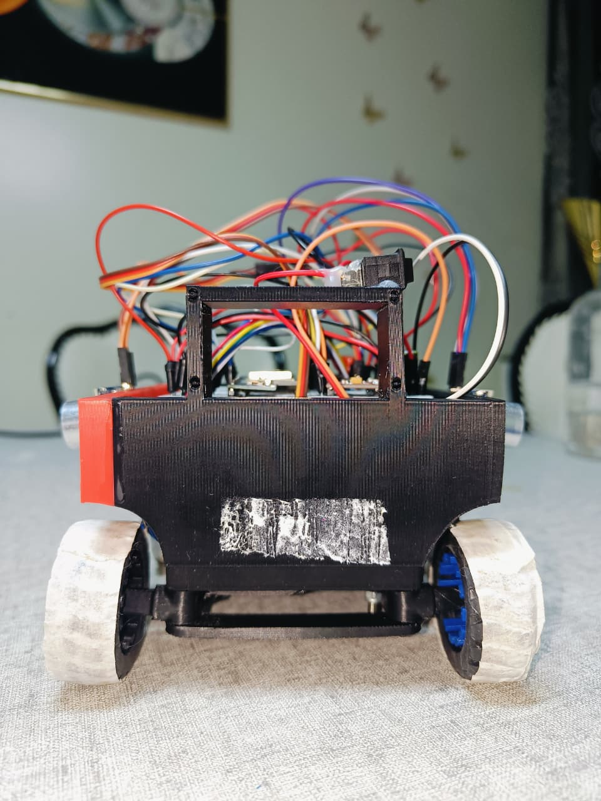<br><b>Front</b></td>
    <td align="center">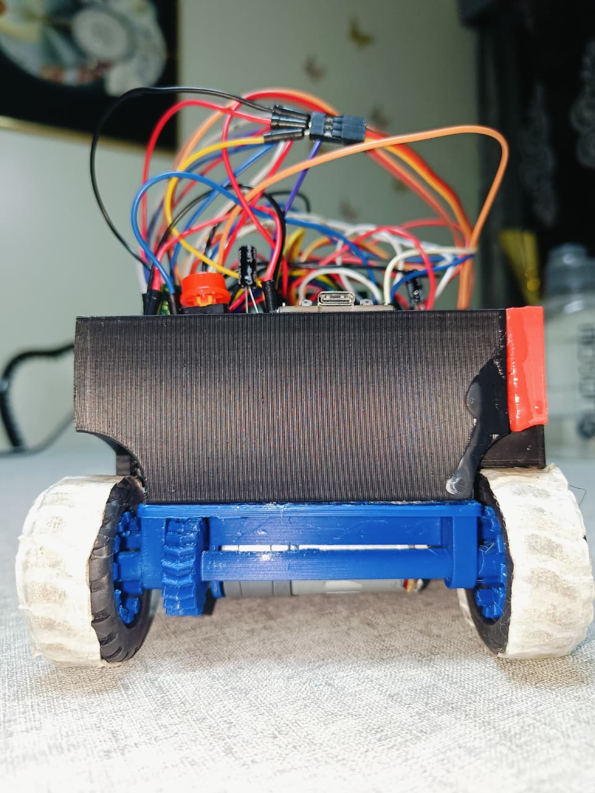<br><b>Back</b></td>
  </tr>
  <tr>
    <td align="center">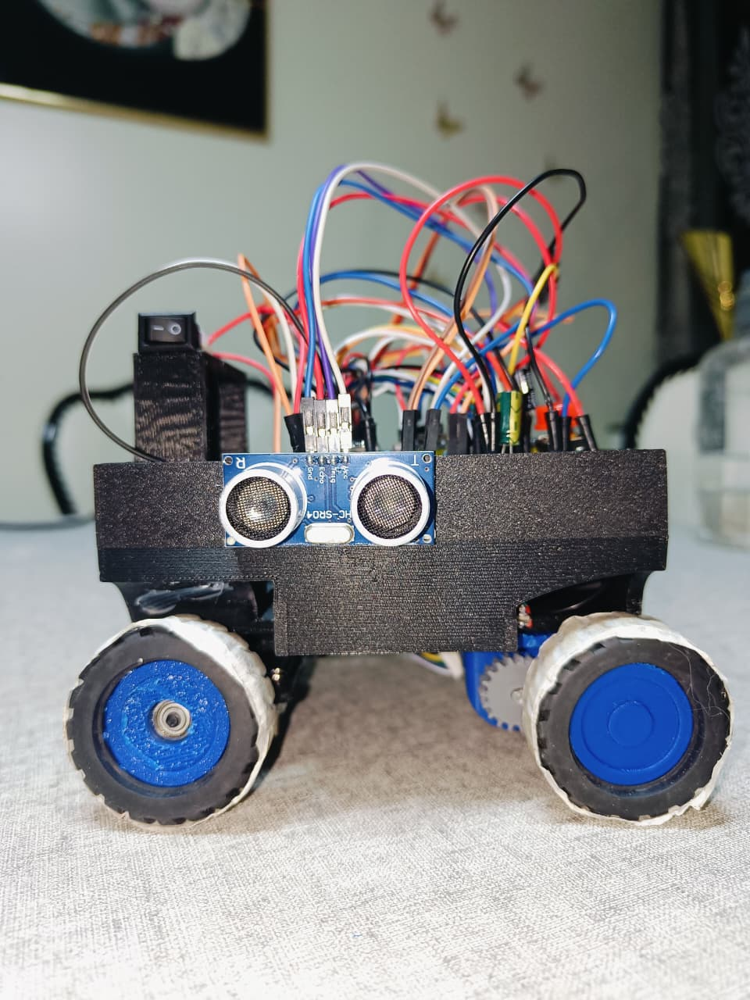<br><b>Left</b></td>
    <td align="center">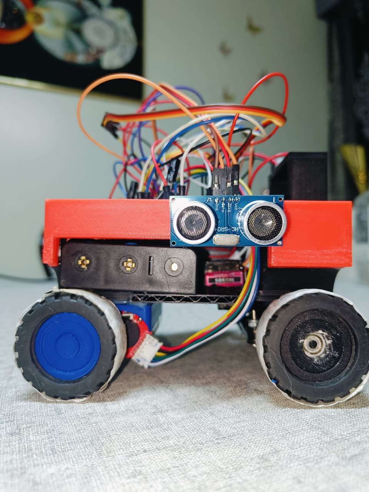<br><b>Right</b></td>
  </tr>
  <tr>
    <td align="center">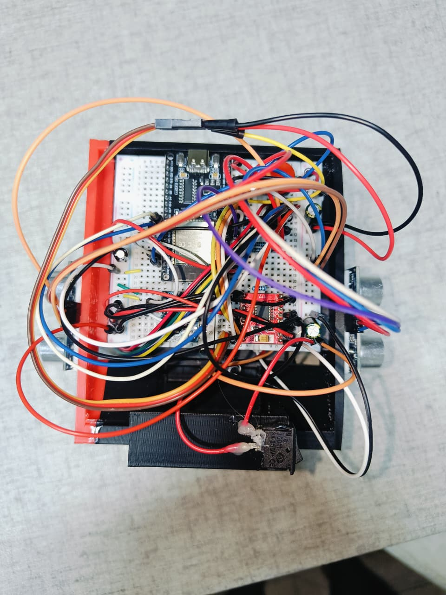<br><b>Top</b></td>
    <td align="center">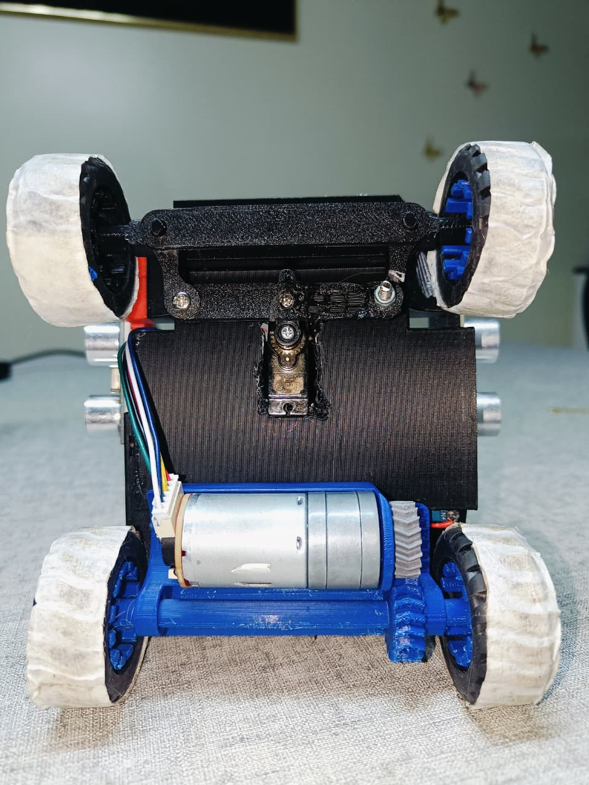<br><b>Bottom</b></td>
  </tr>
</table>

**Front** — the forward ultrasonic sensor mount and the Ackermann front axle.
**Back** — the rear drive axle, motor and gear train.
**Left / Right** — the two side ultrasonic sensors that drive wall following,
mounted level with the chassis so their readings stay square to the walls.
**Top** — ESP32 on a breadboard with the full wiring loom.
**Bottom** — the underside showing the steering linkage, servo, and the blue
rear axle assembly with the motor driving through a gear pair.

---

## 🔧 Where It Was Built

<p align="center">
  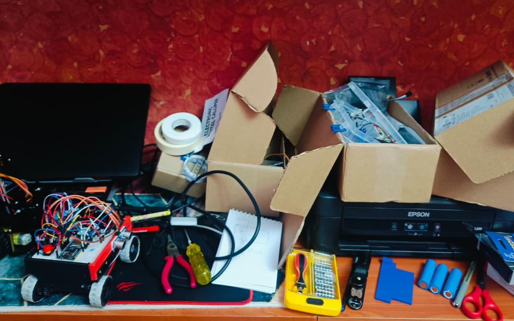<br>
  <em>The workbench through the build — prototyping, debugging and a great
  many spare parts.</em>
</p>


---

## 📑 Table of Contents

- [📸 The Vehicle](#-the-vehicle)
- [🎯 Challenge Overview](#-challenge-overview)
- [🤖 Our Vehicle](#-our-vehicle)
- [⚙️ Mobility and Mechanical Design](#️-mobility-and-mechanical-design)
- [🔋 Power and Sensor Architecture](#-power-and-sensor-architecture)
- [🧩 Components](#-components)
- [🖨️ 3D Printed Models](#️-3d-printed-models)
- [💻 Software Architecture](#-software-architecture)
- [⚖️ Engineering Decisions and Trade-offs](#️-engineering-decisions-and-trade-offs)
- [🔥 Failure Log](#-failure-log)
- [🛠️ Build and Upload Instructions](#️-build-and-upload-instructions)
- [🚧 Known Limitations and Future Work](#-known-limitations-and-future-work)
- [📜 License](#-license)

---

## 🎯 Challenge Overview

The competition runs on a 3000 × 3000 mm track with two challenges.

### 🏁 Open Challenge

Three autonomous laps. Inner wall positions are randomised per round, so each of
the four sections is either **1000 mm or 600 mm wide**, decided by coin toss
after the check time. The starting section, starting zone, and driving direction
(clockwise or counter-clockwise) are also randomised.

**What this forces on the design:** nothing about the track can be hard-coded.
The robot must discover its driving direction at runtime and tolerate a lane
that narrows by 40% without warning.

### 🚧 Obstacle Challenge

Three laps with red and green pillars (50 × 50 × 100 mm) placed randomly, then
parallel parking between two magenta markers.

Per the rules, a **red pillar means keep to the right side of the lane** and a
**green pillar means keep to the left**. Passing a pillar on the wrong side ends
the round as soon as the vehicle fully crosses the line where that pillar sits —
an incorrect pass is not a small penalty, it terminates the run.

---

## 🤖 Our Vehicle

| Property | Value | Limit |
|---|---|---|
| Dimensions (L × W × H) | **140 × 140 × 150 mm** | 300 × 200 × 300 mm ✅ |
| Mass | **550–600 g** | 1500 g ✅ |
| Drive | Rear-wheel drive, single GA25-370 geared motor with encoder | — |
| Steering | Front Ackermann axle, MG90S servo | — |
| Controller | ESP32 (ESP32-WROOM-32) | — |
| Vision | OpenMV Cam H7+ over UART | — |
| Battery | 3S Li-ion (11.1 V nominal, 12.6 V full) | — |

<p align="center">
  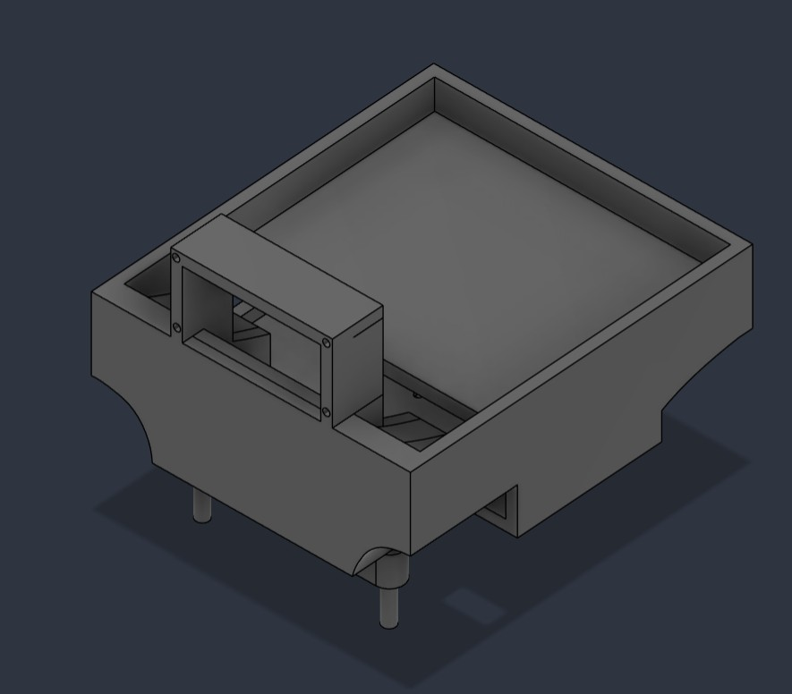<br>
  <em>Main chassis — electronics bay, camera mast, and integrated front axle mount</em>
</p>

---

## ⚙️ Mobility and Mechanical Design

### 🔩 Why Ackermann steering

The rules require a vehicle with **one driving axle and one steering actuator**,
and explicitly disqualify differential-drive robots. We designed our own front
Ackermann axle so that we could control — and justify — every dimension.

Ackermann geometry angles the two front wheels differently in a turn so both
roll along arcs about a common centre instead of scrubbing. The steering arm on
each knuckle must point from its **kingpin** at the centre of the rear axle.

<p align="center">
  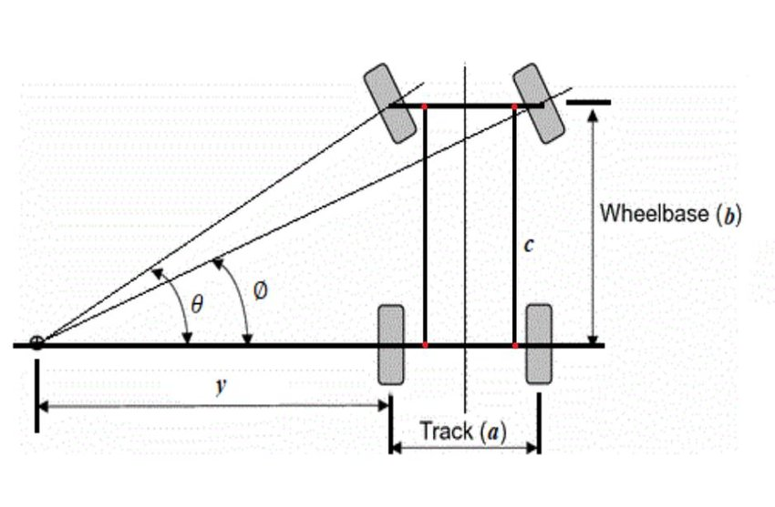<br>
  <em>Ackermann geometry: inner wheel angle θ and outer wheel angle Ø differ so both
  wheels share one turn centre. Track (a), wheelbase (b).</em>
</p>

```
arm angle = atan(kingpin_offset / wheelbase)
```

**This is where we made our first significant error.** Our initial design used
half the track width instead of the kingpin offset, giving 24.2°. The correct
figure for our geometry is:

```
atan(27 mm / 100 mm) = 15.1°
```

The wrong value produces excessive toe-out in corners — the inner wheel steers
far more than the geometry wants and both tyres scrub. We caught it while
re-deriving the linkage from first principles and corrected it.

### 📐 Turning radius

```
R = wheelbase / tan(wheel angle)
```

| Wheel angle | Radius (mm) | 90° arc length (mm) |
|---|---|---|
| 10° | 567 | 891 |
| 15° | 373 | 586 |
| 20° | 275 | 432 |
| 25° | 214 | 337 |

Our linkage (10 mm horn arm driving a 20 mm knuckle arm, ratio 0.5) initially
gave only about 11° at the wheels from ±25° of servo travel — a **500 mm
radius**, too wide for the corners. We increased steering travel after measuring
this.

Rather than trusting the formula, the robot **measures its own turning radius**
using `R = arc_length / angle_in_radians`, taking arc length from the encoder and
angle from the gyro. This captures tyre slip and linkage slop that the formula
ignores.

### 🔧 The steering mechanism

<p align="center">
  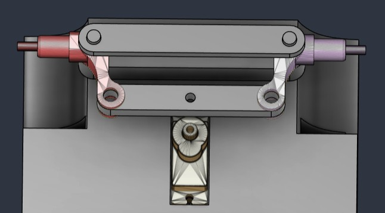<br>
  <em>Complete front axle: servo (bottom centre) drives the horn, which pushes two
  tie rods out to the left and right steering arms. Both knuckles pivot on kingpins.</em>
</p>

<p align="center">
  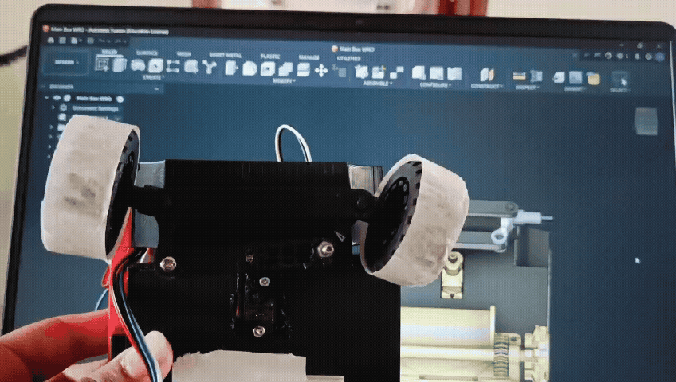<br>
  <em>The assembled mechanism steering through its full travel</em>
</p>

### 🏗️ Structural iteration

The first knuckle design hung from a single M3 bolt threaded into the base plate
— a cantilever in single shear, with the wheel load acting 18 mm outboard of the
kingpin. We identified this as a failure point **before** it broke and redesigned
it as a **yoke**: the kingpin now passes through the plate, the knuckle, and a
lower arm beneath, capturing it at both ends in **double shear**.

The support towers are **lofted rather than straight** — narrow at the pivot,
flaring where they meet the plate. This gives a root cross-section of about
225 mm² against 72 mm² for a plain column: a **3.1× increase** exactly where the
bending moment is highest. A cross-beam ties the two towers together, making
plate, towers and beam a single rigid axle carrier.

### 🛞 The scrub problem (unresolved)

<p align="center">
  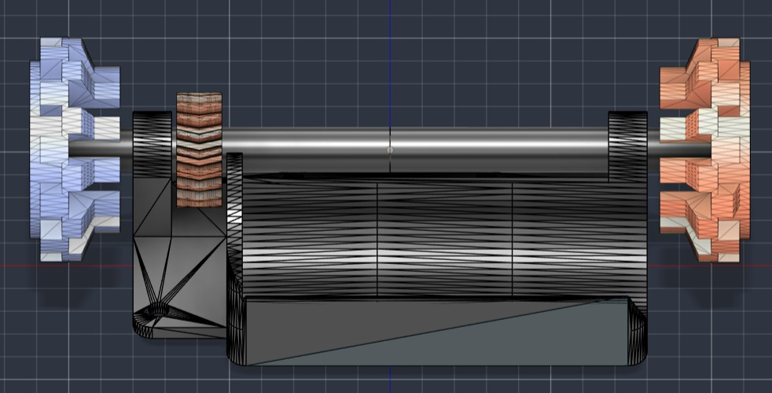<br>
  <em>Rear axle: both wheels fixed to a single solid shaft driven by the motor</em>
</p>

Our rear axle is a solid shaft — both wheels turn at the same speed. In a corner
the outer wheel must travel further than the inner one, and the difference is
fixed by track width alone:

```
difference = track_width × turn_angle_in_radians
           = 90 mm × (π/2) = 141 mm per 90° corner
```

Over 12 corners that is **1.7 metres of forced tyre scrub**. It does not improve
with a wider turn — only track width matters.

**Options we evaluated:**

| Option | Effect | Cost | Decision |
|---|---|---|---|
| Bevel-gear differential | Eliminates scrub | Days of CAD; printed bevel gears usually bind at this scale | ❌ Not achievable in remaining time |
| Free one rear wheel | Eliminates scrub | 15 minutes | ❌ Rejected on rules risk — drive wheels must be physically connected |
| Low-friction tape on rear tyres | Reduces grip so wheels slip | 5 minutes | ❌ Tried, no measurable improvement — tape over knobbly tread doesn't sit flat |
| Narrow the rear tyres | Smaller contact patch resists twisting less | 20 minutes | ⏳ Recommended next step |
| Reduce cornering speed | Spreads scrub over time rather than reducing it | Free | ✅ Implemented as mitigation |

This is an honest open problem in our design and the clearest target for our next
iteration.

---

## 🔋 Power and Sensor Architecture

### ⚡ The power failure that cost us the most time

Our original design used a **2S Li-ion pack (8.4 V)** with:
- a **CN6009 boost converter** raising 8.4 V → 12 V for the motor
- an **LM2596 buck converter** dropping 8.4 V → 5 V for everything else

The robot worked on a fully charged pack and failed completely once cell voltage
fell from 4.20 V to 4.15 V. A 0.05 V change causing total failure is not how a
battery problem behaves — that sharp threshold pointed at a regulator.

**Root cause: a boost converter draws more current in than it delivers out.**

```
input current = (output voltage × output current) / (input voltage × efficiency)
```

| Pack voltage | Motor at 1.0 A | Motor at 2.0 A |
|---|---|---|
| 8.4 V | 1.68 A | 3.36 A |
| 8.0 V | 1.76 A | 3.53 A |
| 7.2 V | 1.96 A | 3.92 A |

As the pack sags, the boost converter demands **more** input current for the same
output. More current through holder and wiring resistance causes more sag. It is
a positive feedback loop, which is why it failed at a cliff edge instead of
degrading gradually.

**Solution: switch to 3S and delete the boost converter.** The motor now runs
directly from the pack.

| | 2S + boost | 3S direct |
|---|---|---|
| Battery current for 1 A motor | 1.68 A | 1.00 A |
| Converters in the motor path | 1 | 0 |
| Failure points | 3 | 2 |

This cut battery current by **43%** for the same motor power and removed the
feedback loop entirely.

### 🔍 Chasing 1.4 volts

Even on 3S the ESP32 reset whenever the servo moved. We measured the whole path
rather than guessing:

| Measurement point | Voltage |
|---|---|
| LM2596 output, no load | 5.11 V |
| 5 V rail, loaded | 4.90 V |
| **ESP32 VIN pin** | **3.80 V** |

The ESP32's onboard AMS1117 regulator needs roughly 1.2 V of headroom above
3.3 V. At 3.8 V it had 0.5 V and browned out. The loss was **resistance in the
wiring**, not a converter fault.

**Fixes applied:**
1. Replaced jumper wires and DuPont connectors on all power paths with **20 AWG
   silicone wire, soldered**. DuPont crimps are rated well below the 1–3 A a
   motor draws and loosen under vibration.
2. Raised converter output to compensate for the remaining drop.
3. Added **electrolytic capacitors at the loads, not at the converter** — wire
   between reservoir and load blunts the effect.

Result: rail sag under servo load fell from **0.44 V to 0.11 V**.

### 🎚️ Servo selection — measured, not guessed

We calculated the steering torque actually required rather than buying the
biggest servo available. Stationary steering torque is dominated by **scrub
torque**, because the kingpin is offset from the wheel centreplane:

```
scrub radius   = 45 mm − 27 mm = 18 mm
load per wheel = 1.5 kg × 0.45 × 9.81 / 2 = 3.31 N
scrub torque   = μ × N × r = 1.1 × 3.31 × 0.018 = 6.56 N·cm per wheel
```

Adding bore torque and both wheels gives **1.51 kg·cm at the kingpins**. The
linkage ratio (0.5) means the servo sees half: **0.76 kg·cm**.

| Servo | Torque at 6 V | Mass | Margin |
|---|---|---|---|
| **MG90S** | 2.2 kg·cm | 13.4 g | **2.9×** |
| MG996R | 11.0 kg·cm | 55.0 g | 14.6× |

**We chose the MG90S.** The MG996R offers a 14.6× margin we have no use for,
while costing 42 g and occupying 37% of the chassis width. It is also an analog
servo with significant gear backlash, and our 0.5 linkage ratio *amplifies*
backlash into wheel wander — precision matters more than torque here.

### 📡 Sensor placement

| Sensor | Purpose | Placement rationale |
|---|---|---|
| 2 × HC-SR04 ultrasonic | Wall following, corner detection | Left and right, facing outward. Lane is 600–1000 mm wide, well within range |
| MPU6050 IMU | Heading during turns | Gyro Z axis only; accelerometer unused |
| Motor encoder | Distance, turning-radius measurement | On the drive motor |
| OpenMV Cam H7+ | Pillar colour and position | Forward-facing on a mast, tilted down |

The ultrasonics fire **one per control loop, alternating**. Firing both together
causes crosstalk — each hears the other's echo. Their ECHO pins connect through
**1 kΩ / 2 kΩ dividers** to drop the 5 V signal to 3.33 V, and use GPIO 34 and
35, which are input-only.

### 🔌 Pin map

| GPIO | Function |
|---|---|
| 14 | Servo signal |
| 16 / 17 | UART2 RX / TX ↔ OpenMV camera |
| 18 / 19 | Encoder A / B |
| 21 / 22 | I²C SDA / SCL (MPU6050) |
| 23 | Start button → GND |
| 25 / 26 / 27 | Motor PWMA / AIN1 / AIN2 |
| 32 / 33 | Ultrasonic TRIG left / right |
| 34 / 35 | Ultrasonic ECHO left / right (input-only) |

---

## 🧩 Components

| Component | Image | Qty | Function | Key specifications |
|---|---|---|---|---|
| **ESP32-WROOM-32** | 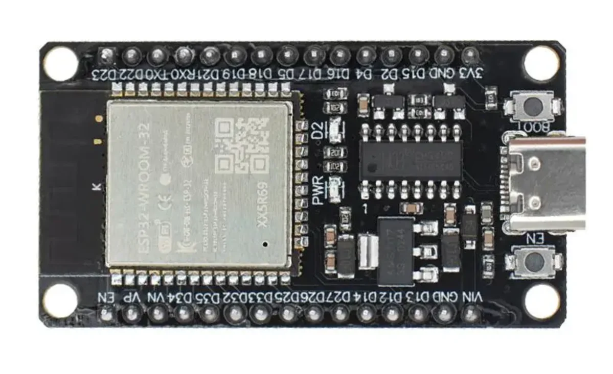 | 1 | Main controller | Dual-core 240 MHz, 3.3 V logic, runs all control and sensing |
| **OpenMV Cam H7+** | 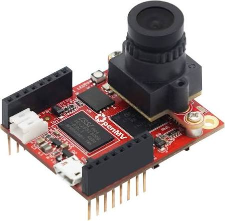 | 1 | Vision processing | STM32H7, QVGA capture, on-board LAB blob detection |
| **GA25-370 geared motor** | 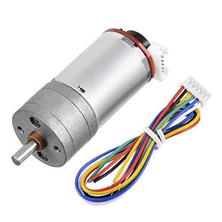 | 1 | Rear-wheel drive | 12 V DC, integrated quadrature encoder (6 wires) |
| **TB6612FNG driver** | 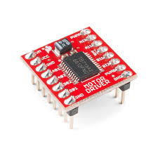 | 1 | Motor control | Dual H-bridge, VM to 13.5 V, 3.3 V logic |
| **MG90S servo** | 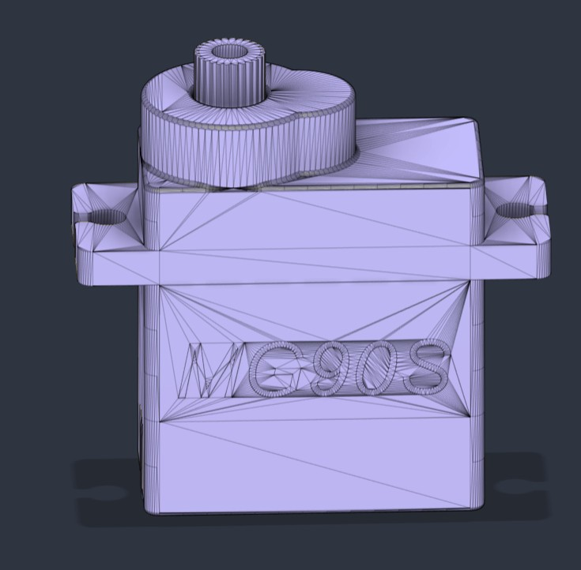 | 1 | Steering actuation | 2.2 kg·cm at 6 V, metal gears, 13.4 g |
| **MPU6050 IMU** | 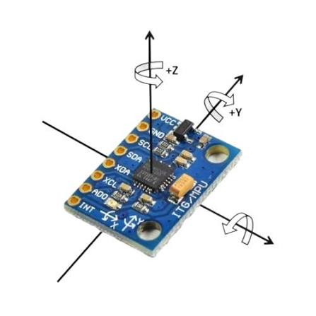 | 1 | Heading measurement | 6-axis, I²C, gyro Z used for yaw integration |
| **LM2596 buck converter** | 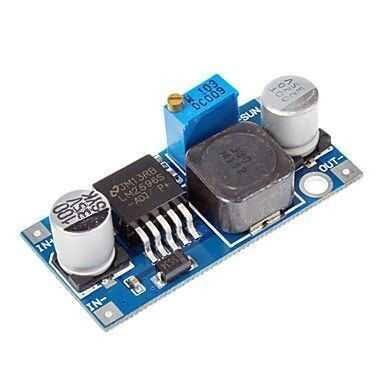 | 1 | 12.6 V → 5 V | 4–35 V in, adjustable out, ~92% efficiency |
| **HC-SR04 ultrasonic** | 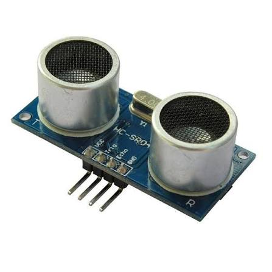 | 2 | Wall distance | 5 V, 2–400 cm, ECHO through 1k/2k divider |
| **3S Li-ion pack** | 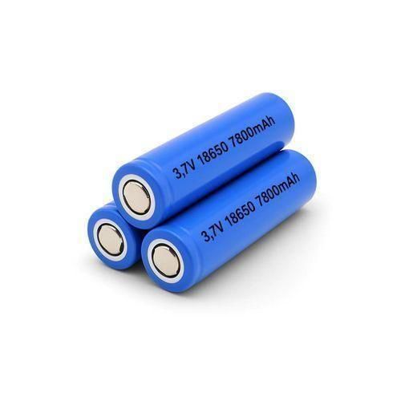 | 1 | Power source | 11.1 V nominal, 12.6 V full |
| **Push button** |  | 1 | Start trigger | GPIO 23 to GND, `INPUT_PULLUP` |

**Component selection philosophy:** we deliberately chose widely available,
well-documented parts so another team can source and reproduce this build. Every
component above is stocked by general electronics suppliers.

---

## 🖨️ 3D Printed Models

All structural parts were designed in **Fusion 360** and printed in PLA.

| Part | Image | Qty | Function |
|---|---|---|---|
| **Main body** |  | 1 | Primary chassis — electronics bay, camera mast mount, front axle interface |
| **Steering arm (knuckle)** | 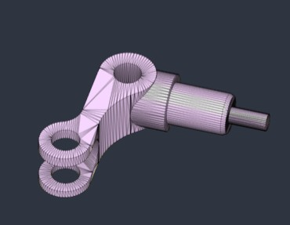 | 2 | Carries the stub axle and pivots on the kingpin; the angled arm sets Ackermann geometry |
| **Steering holder** | 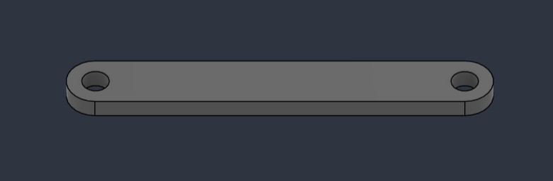 | 1 | Servo mount and kingpin support structure |
| **Steering linkage (tie rod)** | 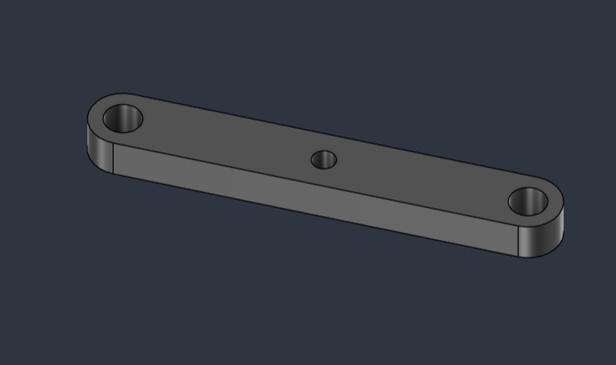 | 2 | Connects the servo horn to each steering arm |
| **Servo horn / bell crank** |  | 1 | Converts servo rotation into linear tie-rod motion |
| **Wheel rim** | 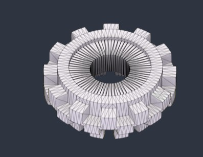 | 4 | Printed rim; rubber tyre fitted over the tread pattern |
| **OpenMV camera holder** | 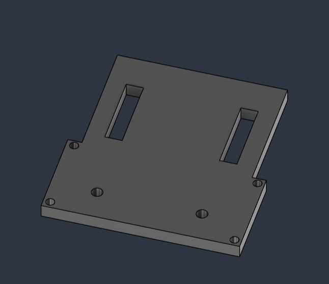 | 1 | Mounts the camera at a fixed downward tilt so the view stays repeatable |

<p align="center">
  
  <br>
  <em>Left: steering arm with integrated stub axle and angled Ackermann arm.
  Right: tie rod linking horn to knuckle.</em>
</p>

**Print notes:** parts print without supports in the orientations supplied.
The steering components use higher perimeter counts, since the tie rods and
steering arms carry the full cornering load through relatively thin sections.

---

## 💻 Software Architecture

### 🔀 Processing split

```
OpenMV Cam H7+                    ESP32
──────────────                    ─────
Image capture                     Ultrasonic ranging
LAB colour thresholding    UART   Gyro integration
Blob detection            ─────▶  State machine
Dominant colour choice    115200  PD wall following
                                  Servo + motor output
```

Vision runs entirely on the OpenMV so the ESP32 never blocks on image processing.
The link is one-way at 20 Hz; the ESP32 control loop runs at 50 Hz.

### 🔄 Open Challenge state machine

```
   ┌──────┐  button   ┌───────┐  wall lost   ┌─────────┐
   │ WAIT │ ────────▶ │ DRIVE │ ───────────▶ │ TURNING │
   └──────┘           └───────┘              └─────────┘
                          ▲                       │
                          └───────────────────────┘
                            90° swept, heading snapped

   after 12 corners:  DRIVE ──▶ FINISHING ──▶ DONE
```

### 🧭 Wall following

<p align="center">
  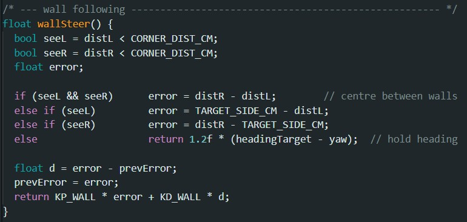<br>
  <em>PD wall-following controller with graceful degradation as walls disappear</em>
</p>

The controller handles four cases in priority order:

1. **Both walls visible** — centre between them: `error = distR − distL`
2. **Only left wall** — hold a fixed offset from it
3. **Only right wall** — hold a fixed offset from it
4. **Neither wall** — fall back to holding the gyro heading

This graceful degradation matters because the lane width changes between
sections, and at a corner one wall genuinely disappears.

### 🔁 Corner turns and drift control

<p align="center">
  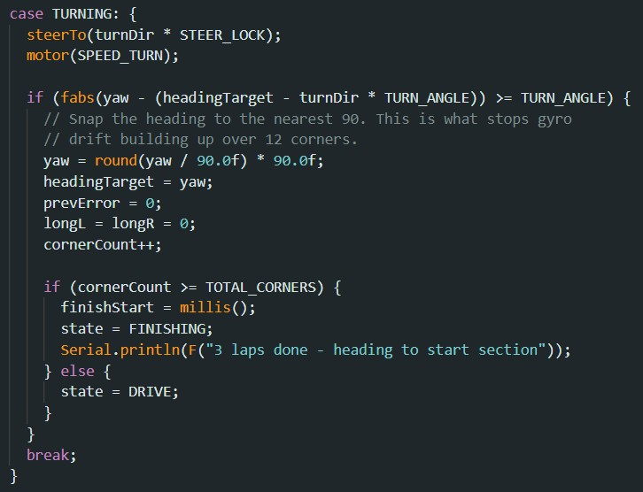<br>
  <em>The TURNING state: gyro-measured 90° turn followed by heading snapping</em>
</p>

**Turns use the gyro, not a timer.** A timed turn varies with battery voltage and
floor grip, so it drifts over 12 corners. "Turn until the gyro says 90°" is
repeatable.

The MPU6050 reports angular *rate*, so heading comes from integration:

```
yaw += (rate − bias) × dt
```

Three measures keep drift bounded:

1. **Bias calibration** — 1500 samples averaged at startup with the robot still
2. **Deadband** — rates below 0.6 °/s treated as zero, so noise on straights
   doesn't accumulate
3. **Heading snapping** — after each corner, yaw resets to the nearest multiple
   of 90°, so each corner corrects the previous straight's error instead of
   compounding it

The third is the single most effective measure, and it is visible in the code
screenshot above.

### 🧠 Direction detection

Driving direction is randomised per round. The robot **decides at the first
corner** — whichever wall disappears first sets the turn direction, which is then
fixed for the entire run. Driving the wrong way ends the round, so this value is
never revised mid-run.

### 🎨 Vision pipeline

<p align="center">
  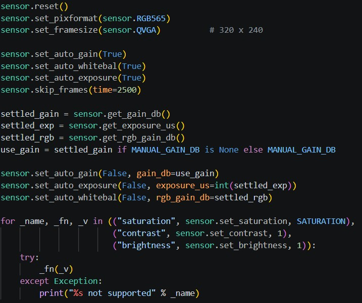<br>
  <em>Camera setup: auto-exposure settles, then gain, exposure and white balance
  are read back and locked so thresholds stay valid</em>
</p>

The locking step matters more than it looks. If auto-gain and auto-white-balance
stay enabled, the sensor continuously re-balances and the LAB thresholds drift
out from under the detection code. We let auto settle, read the settled values,
then fix all three.

**Pipeline:**
1. Capture 320 × 240 RGB565
2. Lock gain, exposure, white balance; raise saturation
3. Convert to LAB and threshold
4. Blob detection with merging, restricted to a region of interest cropping off
   the far wall
5. Choose dominant colour by **total pixel area**, take position from the
   **largest single blob** of that colour

That last distinction is deliberate. Total area answers "which colour dominates";
using it for position too would average two pillars into the gap between them,
and the robot would steer at the gap.

### 🌈 Why LAB and not RGB

LAB separates lightness (L) from colour (A and B), so a dimmer pillar of the same
colour still matches. Thresholds were derived from the official pillar colours
rather than eyeballed:

| Object | RGB | L | A | B |
|---|---|---|---|---|
| Red pillar | (238, 39, 55) | 51.7 | 72.1 | 42.7 |
| Green pillar | (68, 214, 44) | 75.8 | −67.3 | 66.4 |
| Magenta marker | (255, 0, 255) | 60.3 | 98.2 | −60.8 |

**Red and magenta are both strongly positive on A.** They separate only on B,
where red is +42.7 and magenta is −60.8. Knowing this made tuning
straightforward: if magenta reads as red, raise red's B minimum.

We also checked the **orange and blue direction lines** against the pillars. The
orange line sits only 41 units from red in LAB — close enough that lighting
variation will confuse them. Blue is 109 from red and 117 from orange. If we use
the lines for lap counting, we will **count blue only**.

### ▶️ Start procedure

The rules require one switch to power the robot on and a **separate button** to
start the program, and flag auto-start as a recurring source of penalties. Our
robot powers on, calibrates the gyro, prints `READY`, and waits on a debounced
button (GPIO 23, `INPUT_PULLUP`). Yaw zeroes on the press rather than at
power-up, so the heading reference is where the robot actually sits at the start.

---

## ⚖️ Engineering Decisions and Trade-offs

| Decision | Alternative | Why we chose it | What it costs |
|---|---|---|---|
| 3S direct drive | 2S + boost converter | Removes current-multiplication feedback loop; 43% less battery current | Extra cell mass; must not over-discharge |
| MG90S servo | MG996R | 2.9× margin is enough; saves 42 g and 37% of chassis width | Less headroom if the robot gains weight |
| Gyro-timed turns | Fixed-duration turns | Repeatable regardless of battery state | Requires IMU and calibration |
| Heading snap at corners | Continuous integration | Bounds drift instead of letting it compound | Assumes every corner is exactly 90° |
| Vision on OpenMV | Vision on ESP32 | ESP32 never blocks on image processing | Extra board and a UART link to debug |
| LAB colour space | RGB or HSV | Tolerates brightness variation | Thresholds less intuitive to read |
| Dominant colour by area, position by largest blob | Either alone | Avoids steering at the gap between two pillars | Slightly more computation |
| Ultrasonics alternating | Both simultaneously | Eliminates crosstalk | Halves update rate per sensor |
| Printed Ackermann axle | Bought RC chassis | Full control of geometry; every dimension justified | Several print-and-test cycles |
| Open Challenge first | Both challenges at once | Secures the achievable points before attempting the harder round | Obstacle Challenge left incomplete |

---

## 🔥 Failure Log

Documented honestly, because the debugging is where most of the engineering
happened.

| Symptom | Actual cause | How we found it |
|---|---|---|
| Fusion script: *"No target body found to cut"* | Sketch plane exactly coincident with the face being cut | Traced to one operation, then made all cuts start 2 mm outside the material |
| Parts generated but disconnected | Support towers at Y=+11 while the plate ended at Y=+10 — a 1 mm gap. Fusion's Join silently does nothing when bodies don't touch | Checked coordinates numerically instead of visually |
| Knuckles buried 13 mm inside the wheels | Kingpin at ±38 mm with wheel inner face at ±35 mm | Compared geometry numerically — renders looked fine because separate components can interpenetrate |
| Battery collapsed 8.2 V → 0.8 V, wire overheated | Damaged cells and holder contact resistance | Measured under load rather than at rest |
| Worked at 4.20 V per cell, dead at 4.15 V | Boost converter current-multiplication feedback loop | The sharpness of the threshold pointed at a regulator, not a battery |
| ESP32 resetting whenever the servo moved | 1.4 V lost between rail and VIN pin in wiring and connectors | Measured voltage at four points along the path |
| OpenMV: *"'tuple' object isn't callable"* | Firmware 4.5+ changed blob accessors from methods to properties | Wrote a helper accepting both conventions |
| Camera image dark and desaturated | Scene under-lit; auto-exposure already at its limit | Measured frame brightness while sweeping gain and exposure |
| Servo wouldn't move in the combined sketch | ESP32Servo and motor PWM competing for LEDC timers | Worked in isolation; fixed by initialising the servo first on separate timers |
| Spark and bang; ESP32 destroyed | 12.6 V line contacted the 5 V rail | Visible component failure on the board |

**Mitigation after the short circuit:** inline fuse on the battery positive lead,
12.6 V and 5 V runs physically separated and routed on opposite sides, heatshrink
over every exposed terminal, and battery leads mechanically secured so they
cannot shift under vibration.

---

## 🛠️ Build and Upload Instructions

### Requirements

- **Arduino IDE** with ESP32 board support
- Library: **ESP32Servo** (Library Manager). The MPU6050 is driven through raw
  register access over `Wire.h`, so no IMU library is needed.
- **OpenMV IDE** for the camera

### ESP32

1. Open the sketch from `src/`
2. Select your ESP32 board and port
3. Set `TUNING_MODE` to `1` for the first upload — the motor stays disabled while
   sensors print at 10 Hz
4. Upload and open Serial Monitor at **115200**

### OpenMV

1. Open the `.py` file from `src/` in OpenMV IDE
2. Verify detection in the frame buffer
3. **Tools → Save open script to OpenMV Cam (As Main Script)** — pressing Run only
   loads it into RAM and it is lost on power-cycle

### 📋 Calibration order

These are interdependent; doing them out of order wastes time.

1. **`ENCODER_TICKS_PER_REV`** — rotate the wheel 10 turns by hand and read the
   count. Every distance measurement depends on it.
2. **Motor direction and deadband** — confirm forward gives positive ticks; find
   the lowest PWM that moves the shaft.
3. **`SERVO_CENTER`** — on blocks, adjust until the wheels are truly straight. An
   off-centre value makes the robot curve constantly and **no amount of PD tuning
   fixes it**. This is the most common cause of wall-following failure.
4. **`KP_WALL`** — raise until the robot weaves, then back off ~30%. Leave
   `KD_WALL` until KP is close.
5. **`CORNER_DIST_CM`** — read what the side sensors actually report on a
   straight, then set the threshold well above it.
6. **Colour thresholds** — OpenMV IDE → Tools → Machine Vision → Threshold Editor,
   under the lighting you will actually compete in.

---

## 🚧 Known Limitations and Future Work

We would rather state these plainly than omit them.

**Rear axle scrub.** No differential — 141 mm of forced scrub per corner. Next
step is narrowing the rear tyres; the proper fix is a differential.

**Obstacle Challenge incomplete.** Colour detection and steering response work,
but pillar avoidance is not reliable enough to compete, and parking is not
implemented. We prioritised a working Open Challenge over an unreliable Obstacle
attempt, because passing a pillar on the wrong side ends the round.

**Lighting dependence.** Until robot-mounted lighting is fitted, thresholds must
be re-tuned at the venue.

**No speed control loop.** The encoder measures distance but does not close a loop
on speed, so the robot slows as the battery drains. The PWM-to-speed curve is
markedly non-linear, which is why open-loop PWM is not equivalent to commanding a
speed.

**Timed finish.** Stopping in the start section uses a tuned drive time after the
twelfth corner rather than encoder distance — adequate, but sensitive to speed
changes.

### Planned improvements

- ⚙️ Differential, or narrowed rear tyres, to eliminate scrub
- 💡 Robot-mounted LEDs for lighting independence
- 🔁 Closed-loop speed control using the existing encoder
- 🔵 Blue-line counting as an independent cross-check on gyro corner counting
- 📏 Encoder-based finish positioning

---

## 📜 License

GNU Affero General Public License v3.0

This repository will remain public for at least 12 months after the competition.

---

<p align="center">
  <br>
  <strong>Team Vitality</strong><br>
  <em>WRO 2026 Future Engineers</em>
</p>
